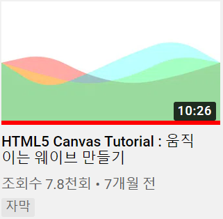

# Canvas Wave Effect

interactive developer 님의 동영상을 따라해보는 프로젝트 그 첫 번째 "움직이는 웨이브 만들기"

# NEW!

## canvas

canvas를 제대로 접해본 첫 번째 프로젝트. canvas context에서 일어나는 간단한 몇가지 함수들을 학습.
(moveTo, lineTo, quadraticCurveTo, fill, stroke)

## requestAnimationFrame

재귀함수 requestAnimationFrame을 학습함. 1초에 모니터 주사율만큼 실행되는 재귀함수이며, 콜백 함수에 인자로 time값을 넘겨줌(이번 프로젝트에서 타임값을 쓰지는 않음)

## javascript bind/this

늘 모호하게만 알고 대충 쓰고 있던 bind/this 개념을 학습. 앞으로 보다 명확하게 javascript:this 개념을 사용할 수 있을 듯.

## WebGL

html5 canvas와 함께 WebGL의 세계에 입문함. 상당히 큰 충격을 받음. 오랜만에 설레이는 감정을 느낌.

## still foolish

내가 코딩을 시작한지 1년밖에 안된 애송이라는 사실을 다시금 깨달음. 프로그래밍 세계는 상상하기 힘들만큼 크고, 내가 아는 것은 육쪽 마늘빵에 올라간 파슬리 하나 만큼도 안됨. 계속해서 배워야 하고, 익혀야 하는 현실을 다시금 직시함.

최근 슬럼프에 빠져서 공부도 게을리 하고, 뭘 해도 의욕이 잘 나지 않았었는데, 좋은 동기부여가 되었음.

# Review

이 프로젝트는 이번에 몸살감기에 걸려서 집에서 하루 종일 누워있다가, 뭐라도 조금 해야겠다는 생각에 시도해보게 된 프로젝트.

이 interactive develeper님을 보면서 많은 생각을 하게됨. 앞으로 개발자로서 어떻게 살아가야 할지에 대한 옅은 빛을 엿볼 수 있었던 기회.

WebGL에도 많은 관심이 생김. 디자인에 대한 관심도 늘 어느정도 있었지만, 제대로 해보고 싶다는 생각이 듬.
